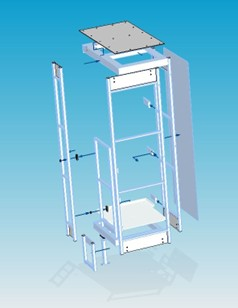
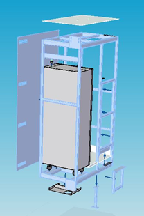
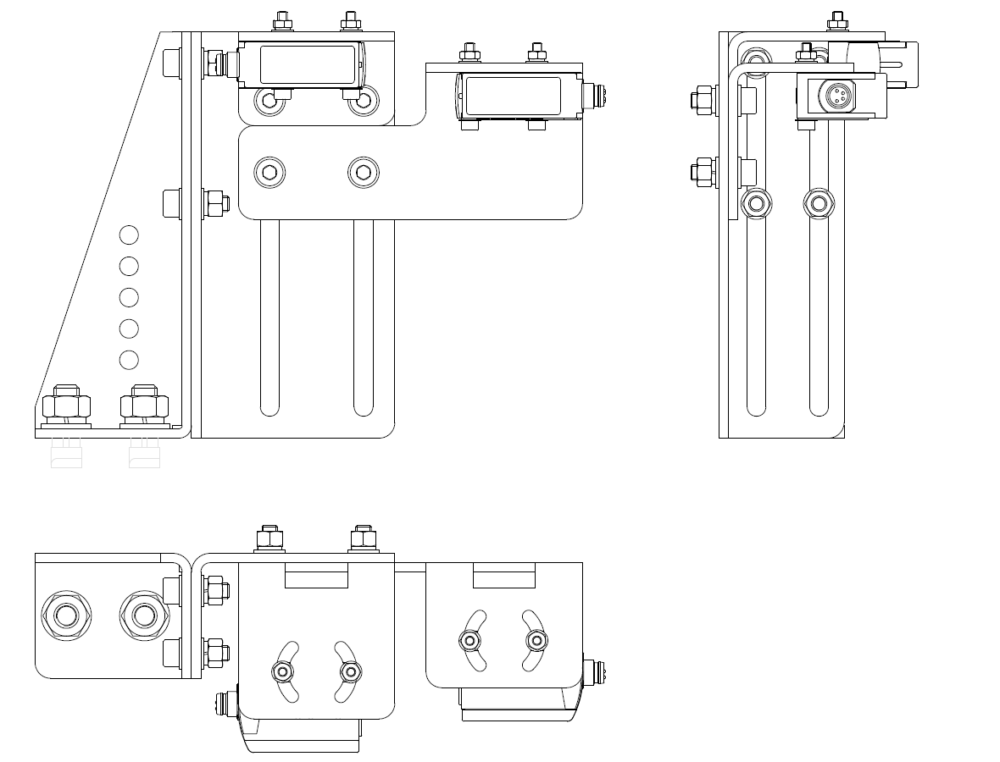
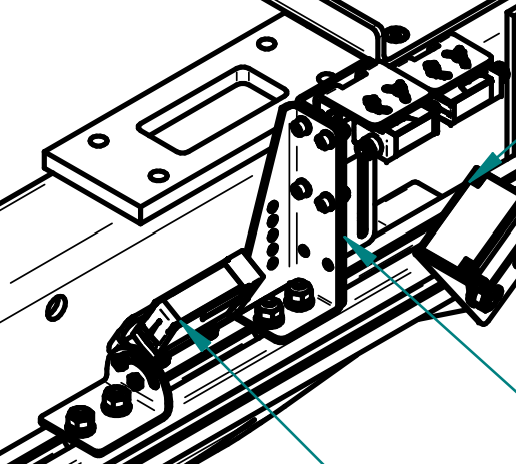

# Design Examples  
Non-confidential examples of my mechanical design work

This document summarizes several representative mechanical design projects I completed in the logistics automation industry.  
All examples are rewritten to ensure no confidential drawings, parameters, or proprietary details are included.

---

## ## 1. Stacker Crane – Operator Platform Optimization  
**Objective:** Reduce weight, material cost, and assembly labor while improving structural stiffness and usability.

### **My Role**
- Led the redesign of the operator platform structure.  
- Converted a multi-piece bolted frame into an integrated welded structure.  
- Performed static & dynamic FEA to validate stiffness and safety.  
- Analyzed production, assembly, and installation workflows.

### **Key Improvements**
| Category | Before | After | Improvement |
|---------|--------|-------|-------------|
| Structure | Multi-piece, bolt-connected | Integrated welded frame | ↑ Strength, ↓ fasteners |
| Material usage | Many tube types | Reduced tube types | ↓ 50% types |
| Weight | 155.5 kg | 125.8 kg | ↓ 19.1% |
| Assembly labor | 5 hrs | 3 hrs | ↓ 40% |
| Site installation | 4 hrs | 2 hrs | ↓ 50% |
| Packaging | 2 boxes | 1 box | ↓ Damage risk |

### **Engineering Highlights**
- Increased main frame tube thickness from **2 mm → 3 mm** for stiffness.  
- Eliminated separate control-cabinet bracket by integrating support into the main frame.  
- Added:
  - **Spring latch** on guard door → reduces vibration noise & improves safety.  
  - **Bottom cable management plate** → improved wiring routing & maintenance.  
- Conducted real-load experiment using **200 kg counterweight + 75 kg human load**.  
- Performed static and dynamic FEA:
  - Max deformation ≈ **1.2 mm**  
  - Max stress ≈ **137 MPa** < yield strength of Q235A  
  - Dynamic acceleration ±0.5 m/s² → no structural risk  

### Before Optimization

  

### After Optimization

  

---

## ## 2. Gantry System – Cable Carrier Length Calculation  
**Objective:** Ensure proper routing space and motion clearance for vertical and horizontal travel.

### **My Role**
- Developed calculation sheets for drag-chain required length.  
- Added motion margin, bending radius constraints, and installation tolerances.  
- Coordinated with electrical team to verify cable bundle size and routing.

### **Key Engineering Work**
- Calculated:
  - Total stroke  
  - Bending radius  
  - Pre-tension and safety allowance  
- Proposed improved mounting brackets to simplify assembly and reduce collision risk.

---

## ## 3. Detection Mechanism for Beam Deflection  
**Objective:** Improve accuracy of detecting shelf beam settlement in automated warehouse systems.

### **My Role**
- Evaluated feasibility of multiple detection methods (optical sensor, mechanical switch, linear encoder).  
- Proposed optimal optical sensing layout based on:
  - Required precision  
  - Pallet color interference with sensor detection  
  - Installation space  
  - Cost/performance balance  

### **Outcome**
- Designed a **lightweight, modular mounting plate** for photoelectric sensors.  
- Reduced adjustment time and minimized false detection issues.

### Photoelectric sensor and bracket for detection

  
  

---

## ## 4. Mechanical Component Selection for New Crane Modules  
**Objective:** Select appropriate mechanical parts for customized modules.

### **Components I Have Worked On**
- Wire ropes  
- Winch drum selection  
- Motor drive shaft  
- Aluminum profile framing  
- Pulley assemblies  

### **My Role**
- Identified load cases & operation cycles  
- Consulted vendors and compared technical specs  
- Ensured compatibility between mechanical and electrical interfaces  

---

## ## 5. CAD Drawing & Modeling Work (2D-focused)
**Objective:** Deliver complete engineering drawing packages for manufacturing and assembly.

Even though many legacy projects used mostly 2D CAD, I produced:
- **Assembly drawings**  
- **Part drawings**  
- **Tolerance analysis**  
- **Exploded diagrams**  
- **BOM extraction**

### Strengths Highlighted
- Careful dimensioning to avoid interference  
- Clear section views to assist welders and machinists  
- Manufacturability review with workshop engineers  

---

## ## 6. Safety & Usability Enhancements (Small but High-impact Improvements)

### Examples
- Added adjustable rubber buffers under control cabinet → prevents vibration damage.  
- Optimized footstep spacing and angle → improves operator ergonomics.  
- Improved guard-door hinge design → smoother movement + lower maintenance.  
- Added cable-channel dividers → prevents cable entanglement.

These improvements were often implemented after field feedback and significantly improved reliability.

---

## ## 7. Engineering Change Management (ECR/ECN)
**Objective:** Implement design changes systematically and traceably.

### **Trigger Conditions**
- Customer requests  
- On-site feedback  
- Manufacturing issues  
- Safety improvements  

### **Execution**
- Update CAD models & modify drawings  
- Revise BOM  
- Communicate changes to:
  - Procurement  
  - Manufacturing  
  - Electrical team  
  - Documentation team  

### **Outcome**
→ **Traceable, consistent, and safe engineering improvements across the full product lifecycle**

---

# End of Document

