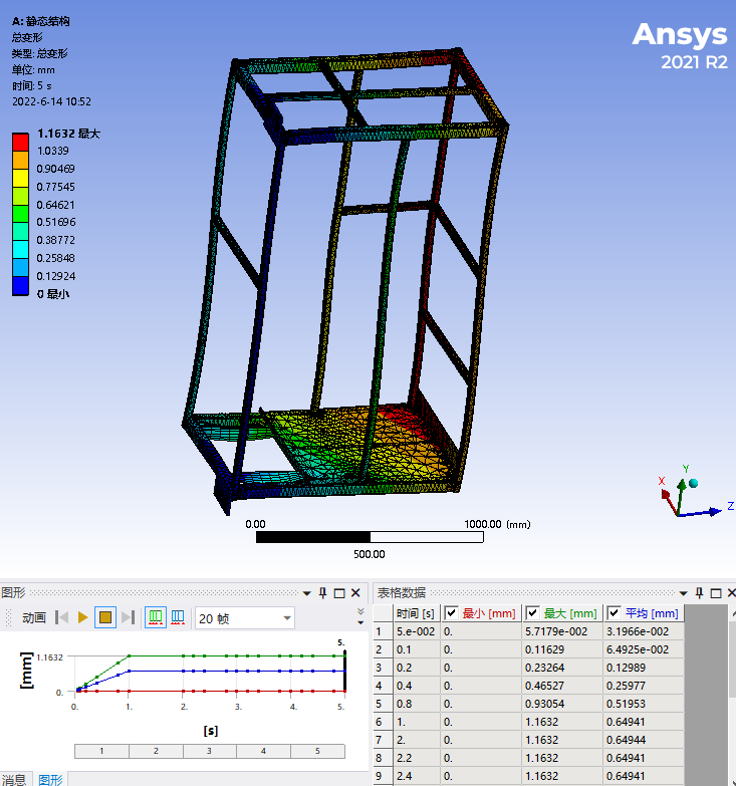
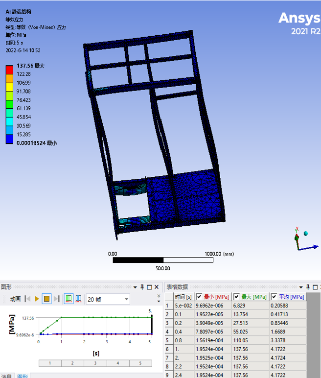

# FEA Demonstration (Non-Confidential)

This page summarizes several simplified FEA studies I completed to validate mechanical behavior of stacker-crane components.  
All models shown here are **non-confidential**, re-created or simplified for public presentation.

---

# 1. Platform Structure — Static & Dynamic Analysis  
*(Based on simplified geometry and public-safe parameters)*

## 1.1 Objective
To evaluate the stiffness and stress distribution of a welded operator-platform frame under combined loading:

- **Cabinet load:** 300 kg  
- **Operator load:** 75 kg  
- **Self-weight:** simplified using material density  
- **Dynamic loads:** ±0.5 m/s² horizontal acceleration  

The goal is to verify whether the optimized welded-frame structure provides sufficient stiffness and safety margin.

---

## 1.2 Boundary Conditions & Loads
- Base mounting plates constrained in all degrees of freedom  
- Cabinet load applied as a distributed force on the support frame  
- Human load applied as a point load on the walking surface  
- Material: **Q235A steel (Equivalent to ASTM A36 steel)**  
  - Elastic modulus: 210 GPa  
  - Poisson's ratio: 0.26  

---

## 1.3 Results Summary

### **Maximum Deformation (Static Load)**
- **1.2 mm**, located near diagonal support regions  
- Within acceptable stiffness range for operator platforms  

### **Maximum Stress**
- **≈137 MPa**, located at rectangular-tube junctions  
- Still **below yield strength of Q235A (~235 MPa)**  
- Safety factor > **1.7**

### **Dynamic Load (±0.5 m/s²)**
- Deformation remained ≈ **1.2 mm**  
- Stress variation negligible (<1 MPa difference)
  

  
  

<strong></strong> Static deformation (left) and static stress distribution (right)

---

## 1.4 Interpretation
Even under combined static + dynamic loads, the welded platform structure maintains:

- Sufficient rigidity  
- Acceptable stress levels  
- Predictable deformation pattern  

This confirms the structural feasibility of the optimized design.

---

# 2. Column Structure — Preliminary Global Stiffness Evaluation  
(*This load case represents an emergency stop scenario. The frame is constrained at wheel contact regions (ground support), and an equivalent inertial load is applied along the travel direction to capture deceleration effects.*)

## 2.1 Objective  
To assess the bending stiffness of a **24-m-tall stacker-crane column (400×300 mm steel section)** under self-weight and running acceleration.

This is a **global stiffness check**, not a detailed joint simulation.

---

## 2.2 Model Setup  
- Column separated into top beam, bottom frame, front & rear columns  
- Material: **Q235A**  
- Mesh:  
  - Global element size: 50 mm  
  - Local refinement at stress-concentration zones: 1 mm  
- Node count: 125,611  
- Element count: 20,360  

> *(Insert later)*  
> - 

---

## 2.3 Boundary Conditions  
- Bottom-left constrained (fully fixed)  
- Bottom-right constrained in X/Z directions  
- Top beam ends constrained in X direction  
- Applied loads:  
  - Gravity  
  - Horizontal acceleration: **0.5 m/s²**  
  - Payload + carriage weight: **5 tons** (simplified mass distribution)

> *(Insert BC image later)*  
> - 

---

## 2.4 Results (Preliminary)

### **Maximum deformation (5 m unsupported span):**
- **≈15.65 mm** at column top  

### **Stress distribution:**
- Peak stress **≈54.5 MPa**, mainly at connections and bending zones  
- Within acceptable range for Q235A steel  

### **Comparison with theoretical deflection**
- Analytical allowable deflection range:  
  - f = H/2000 ~ H/1000 = 12–24 mm  
- FEA result: **15.65 mm → within allowable range**  

> *(Insert contour plots later)*  
> -   
> - 

---

# 3. Notes & Planned Improvements

The current analysis is intentionally simplified for public sharing.  
After refining the model, I plan to update:

### ✔ Load application  
- More accurate distribution of carriage + fork mass  
- Realistic load path at rail connections  

### ✔ Contact definitions  
- Add bolt-group stiffness  
- Add plate-to-beam contact friction  

### ✔ Boundary conditions  
- Replace idealized constraints with realistic supports  
- Include column-to-rail interaction stiffness  

### ✔ Added studies  
- Modal analysis  
- Fatigue risk screening  
- Local reinforcement checks (holes, cutouts, welded joints)

---

# 4. Summary

These simplified FEA demonstrations show:

- My ability to **build FEA-ready geometry**  
- Set up **realistic boundary conditions**  
- Perform **static & dynamic structural analysis**  
- Interpret results and compare them with **engineering theory**  
- Document engineering findings in a professional format  

The models here will continue to be iterated and enriched with more accurate loads, contacts, and test results.

---

