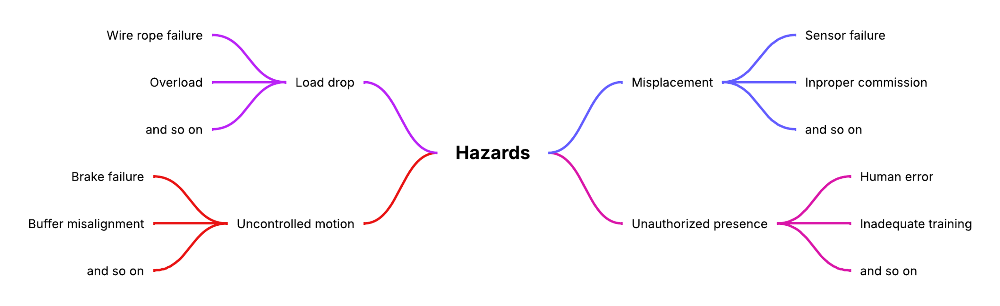
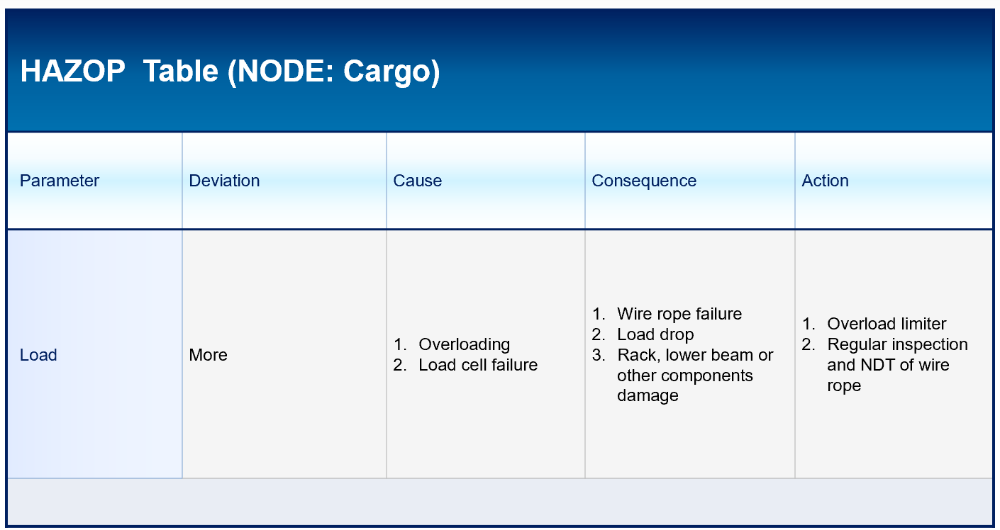
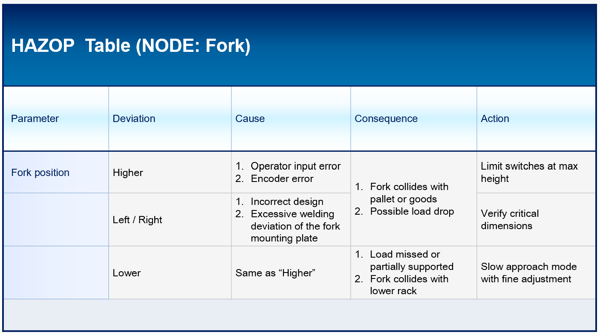

# HAZOP Study – Stacker Crane

This document summarises the **HAZOP (Hazard and Operability)** analysis I performed for the stacker-crane system.

> _Image placeholder – Main Hazards_  

  

---

## 1. Nodes and Parameters

Analysed nodes:

1. **Cargo node** – pallet and load on the fork
2. **Fork node** – fork vertical / horizontal position relative to rack and pallet

Typical guidewords: **More / Less / No / High / Low / Mis- / Other than**.

---

## 2. HAZOP – Cargo Node

> _Image placeholder – Cargo node sketch_  

  

---

## 3. HAZOP – Fork Node

> _Image placeholder – Fork node sketch_  

  

---

## 4. Key Findings

- **Most critical deviations** involve **overload** and **fork position errors**.
- Many hazards can be mitigated by:
  - Redundant **limit switches / sensors**
  - **Speed reduction** near the rack
  - Clear **load-rating and operating procedures**
- The HAZOP results are later mapped into the **quantitative risk matrix** in `Risk-Matrix.md`.

> _Image placeholder – HAZOP summary chart_  
> ``

