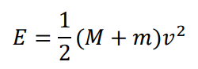
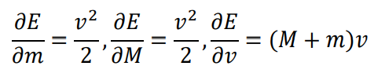
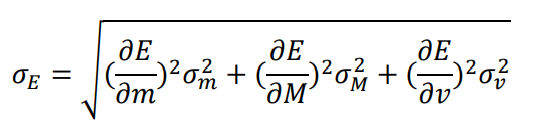

# Kinetic Energy & Uncertainty-Based Risk Analysis

## Objective

This section evaluates the **risk associated with uncontrolled horizontal motion** of an automated stacker crane using **kinetic energy modeling combined with uncertainty propagation**.  
The analysis supports **buffer selection and speed-control decisions** under worst-case conditions.

---

## Kinetic Energy Definition

The horizontal kinetic energy of the crane–load system is defined as:

📌 **Equation 1: Kinetic Energy**

  

Where:

- `M` — self-weight of the stacker crane  
- `m` — payload mass  
- `v` — horizontal travel speed  

This energy represents the **maximum impact energy** that must be absorbed during emergency stop or control failure.

---

## Uncertainty Sources

In practical operation, the dominant uncertainty sources are:

- Payload mass variation  
- Velocity control error  

The crane self-weight is treated as deterministic compared with these variables.

---

## Sensitivity Analysis

To propagate uncertainty, first-order partial derivatives of kinetic energy are used as sensitivity coefficients:

📌 **Equation 2: Sensitivity to Payload Mass/Crane Mass/Speed**

  

These terms describe how mass and speed deviations influence total kinetic energy.

---

## Uncertainty Propagation

Assuming independent uncertainty sources, the combined standard uncertainty of kinetic energy is calculated as:

📌 **Equation 3: Error Propagation Formula**

  

This enables estimation of an **upper-bound kinetic energy** rather than relying on a nominal value.

---

## Engineering Interpretation

- Nominal kinetic energy defines **baseline buffer capacity**
- Propagated uncertainty defines **required safety margin**
- If the upper-bound energy exceeds buffer rating:
  - travel speed must be reduced, or  
  - higher-capacity buffers must be selected  

This links **mechanical modeling directly to risk mitigation decisions**.

---

## Role in Overall Risk Assessment

This analysis provides quantitative support for hazards identified by:

- **HAZOP** — uncontrolled motion scenarios  
- **Risk Matrix** — high-severity collision risks  
- **Error-rate analysis** — operational variability  

Together, these methods form a **defensible, multi-layered risk assessment framework**.
