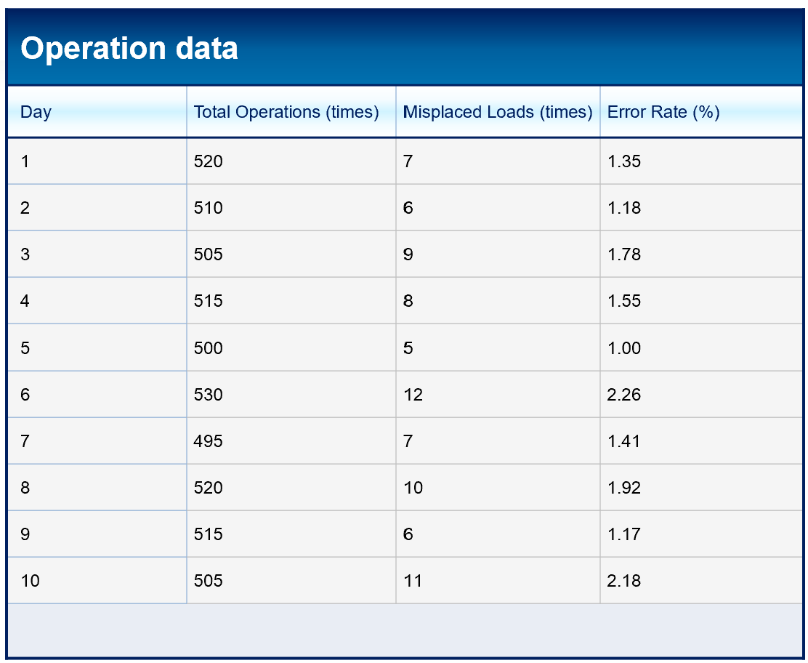

# Load Positioning Error – Statistical Analysis

This document summarises my analysis of **load positioning errors** for the stacker-crane system.

---

## 1. Objective

Evaluate:

- How often the crane **misplaces loads** (error rate)
- Whether the error rate is **stable** or has **outliers / abnormal days**
- How this supports **overall risk assessment**

> _Image placeholder – data table_  

  

---

## 2. Error Rate Definition

For each day:

\[
\text{Error Rate} = \frac{\text{Number of misplacements}}{\text{Total storage / retrieval operations}} \times 100\%
\]

Where:

- **Misplacements** = loads not stored or retrieved in the correct location
- **Total operations** = all successful + misplacement attempts

---

## 3. Data Summary

Using 10 days of operating data:

- **Mean error rate:** approximately **1.6 %**
- **Median:** ~**1.5 %**
- **Min / Max:** within a narrow range (no extreme spikes)
- **IQR (Interquartile Range):** moderate → variations between days are small.

> _Image placeholder – histogram_  
> ``

> _Image placeholder – boxplot_  
> ``

---

## 4. Outlier Check

Based on the boxplot:

- Upper fence ≈ **3.4 %**
- All observed daily error rates are **below** this fence.  
- **No statistical outliers** were detected.

This suggests that:

- Misplacement events are **random but controlled**, not dominated by a few “bad days”.
- The system behaves **consistently**, which is important for risk modelling.

---

## 5. Interpretation for Risk

- Even a **small error rate** can be critical if a misplacement leads to:
  - **Collision risks** (fork vs. rack)
  - **Incorrect load handling** (wrong pallet picked)
- The **error rate** is therefore combined with **hazard severity** in `Risk-Matrix.md`.

> _Image placeholder – combined risk chart_  
> ``

