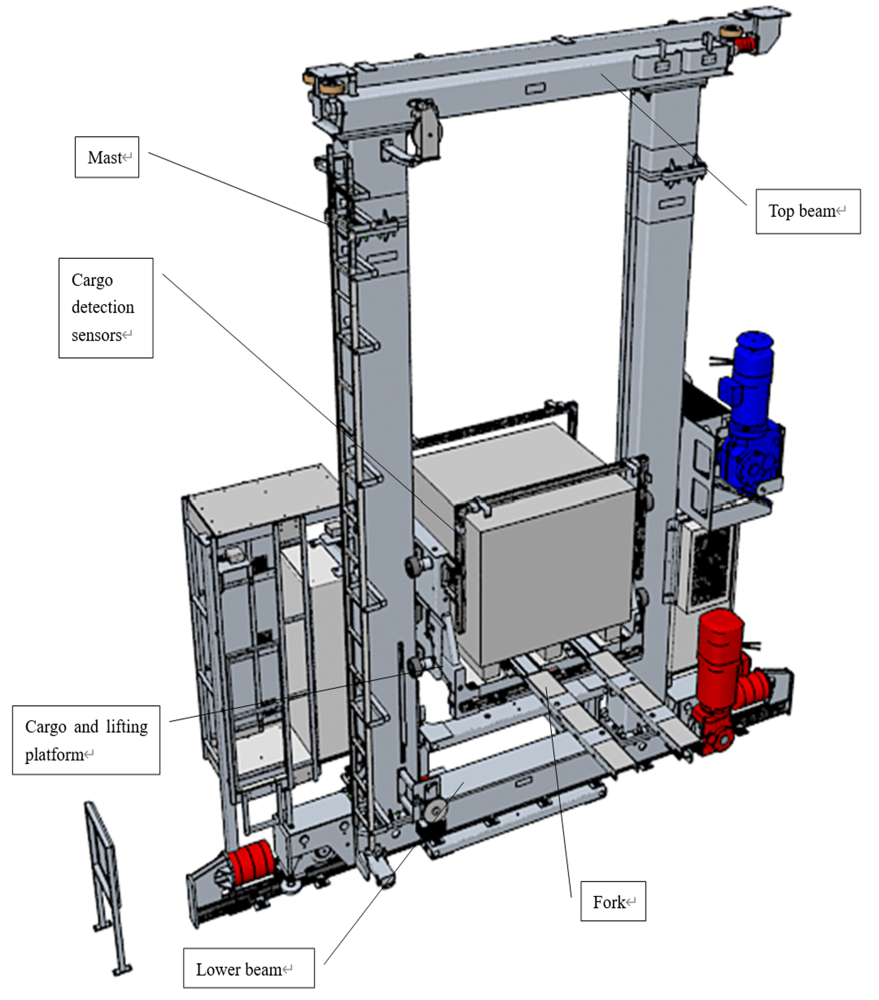

# Risk Analysis – Stacker Crane System

This folder documents my risk assessment work for a **stacker crane** used in automated warehouse operations.  
The work was completed as part of **ENGG*6010 – Assessment of Engineering Risk** at the University of Guelph.

> Focus: From qualitative HAZOP to quantitative analysis  
> (load positioning error, kinetic energy, and uncertainty propagation).

---

## Files in this folder

- **[HAZOP.md](HAZOP.md)**  
  Structured HAZOP (Hazard and Operability) study for key nodes of the stacker-crane system.

- **[Load-Positioning-Error.md](Load-Positioning-Error.md)**  
  Statistical analysis of **load misplacement rate** using real / realistic operational data.

- **[Kinetic-Energy-Uncertainty.md](Kinetic-Energy-Uncertainty.md)**  
  Calculation of the system **kinetic energy** under emergency stop conditions, including **error propagation**.

- **[Risk-Matrix.md](Risk-Matrix.md)**  
  Consolidated **risk matrix** summarising likelihood, severity, and recommended mitigations.

---

## System Overview

The analysed system is a **stacker crane** that travels along an aisle between racks, lifting and placing pallets.

- **Main components**
  - Mast (vertical structure)
  - Bottom frame and travel wheels
  - Lifting platform and fork
  - Drive system and control cabinet
- **Typical operating modes**
  - Horizontal travel along the aisle
  - Vertical lifting / lowering
  - Pallet loading / unloading

> _Image placeholder – system overview_  

  

---

## Analysis Scope

This mini-project focuses on three questions:

1. **What can go wrong?**  
   → Identified through a **HAZOP** study for “Cargo” and “Fork” nodes.

2. **How often do positioning errors happen?**  
   → Estimated from **daily misplacement data**, using histogram and boxplot to check variability and outliers.

3. **How dangerous is an emergency stop with full load?**  
   → Evaluated via **kinetic energy** and **uncertainty analysis** (mass and speed tolerances).

---

## My Contributions

- Built the **risk model** starting from system description and standards.
- Performed **HAZOP** for critical nodes and translated it into a **risk matrix**.
- Analysed **load-positioning error data** and interpreted the statistical results.
- Calculated **kinetic energy** under worst-case emergency stop and quantified **uncertainty** using partial derivatives.
- Summarised results into a concise engineering report and presentation.

> _Image placeholder – example slide or diagram_  
> ``

---

