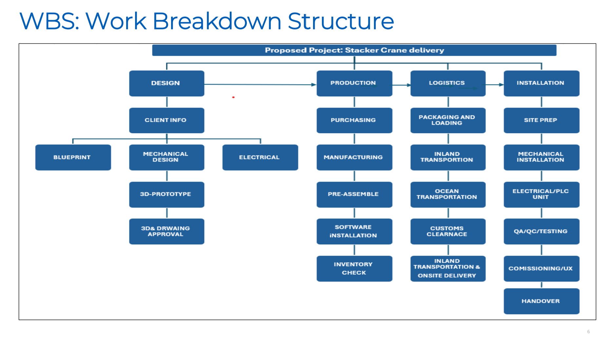
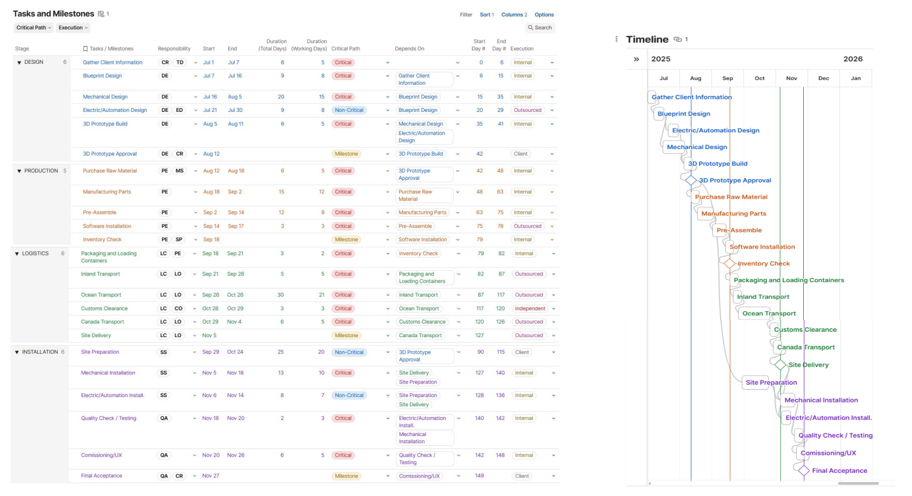
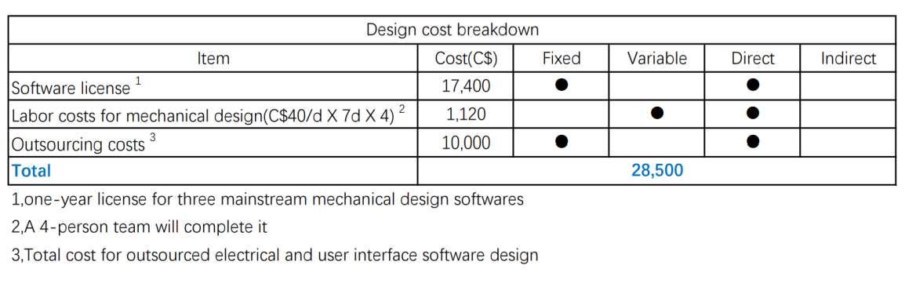
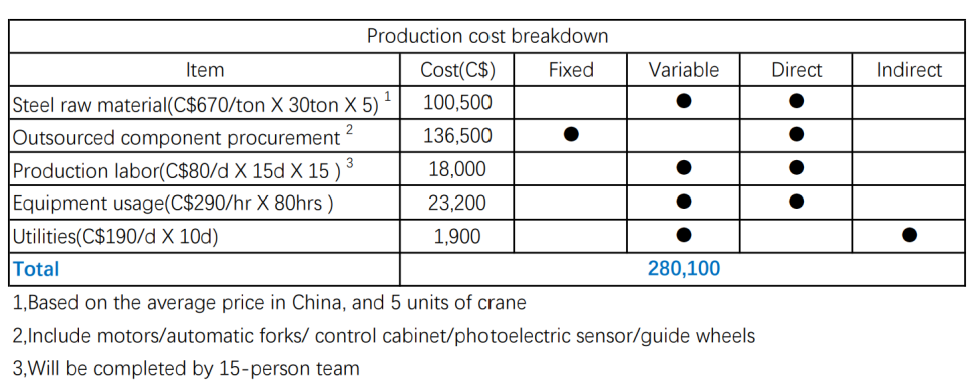
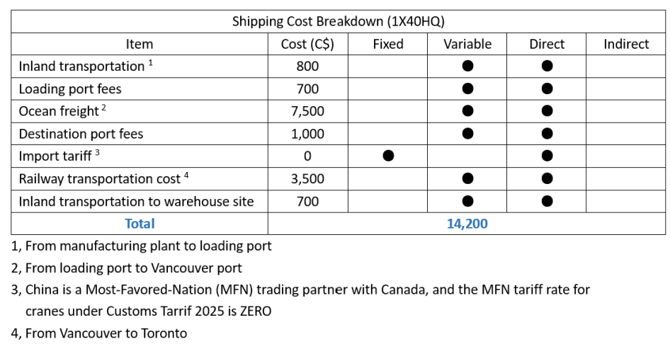
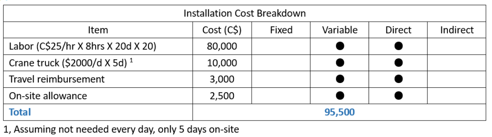
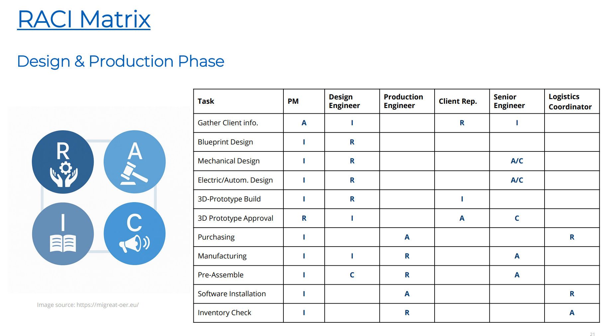
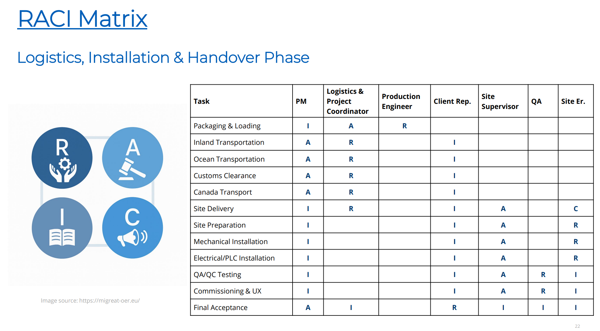
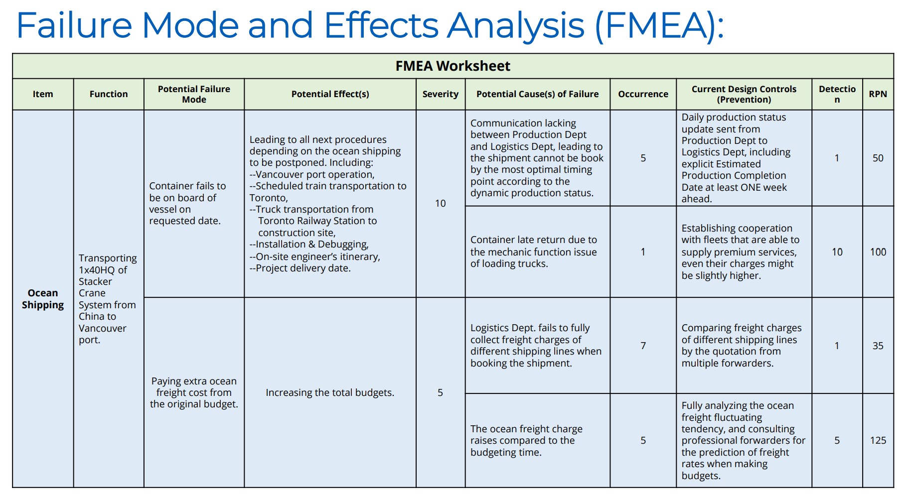

# Application of Project Management Principles: Stacker Crane Deployment

## Project Context

This team project simulates a real industrial scenario in which an engineering firm designs, manufactures, ships, and installs **five double-mast stacker cranes** for a distribution warehouse in Ontario, Canada.

The project scope covers the **full project lifecycle**, from planning and design to international logistics and on-site installation.

---

## Project Objectives

- Deliver 5 stacker crane systems by **November 2025**
- Control total project cost within **C$460,000 (including contingency)**
- Meet Canadian quality and safety standards
- Coordinate multi-phase, cross-functional engineering activities

---

## Project Management Tools Applied

The following PM tools were applied in an integrated manner:

### Work Breakdown Structure (WBS)
- Decomposed the project into design, production, logistics, and installation phases  
- Defined clear task boundaries and deliverables  

  

---

### Schedule Planning & Critical Path Analysis
- Developed a full Gantt chart with task dependencies  
- Identified critical-path activities affecting project duration  
- Evaluated schedule compression (crashing) options  

📌 **Gantt Chart & CPM Overview**  
[🔗 Click here for interactive Gantt chart (online)](https://coda.io/d/Crane-Project_d9_OyeiMAmZ/Crane-Project-Management_sukfNqKR#Tasks-and-Milestones_tuaYQC0N)

  

  

---

### Cost Estimation & Budget Control
- Estimated design, production, shipping, and installation costs  
- Applied contingency planning to manage uncertainty  

  

  

  

  

---

### Responsibility Assignment (RACI)
- Defined clear roles across engineering, logistics, QA, and client stakeholders  
- Reduced ambiguity in task ownership  

  

  

---

### Risk Management (FMEA)
- Identified high-risk activities such as international shipping delays  
- Evaluated severity, occurrence, and detection to calculate RPN  
- Proposed mitigation strategies for high-risk items  

  

---

## Personal Contributions

My primary contributions to this team project included:

- **Cost estimation and budgeting analysis**
- **Failure Mode and Effects Analysis (FMEA)**
- Participation in schedule planning and risk discussion
- Cross-functional coordination within the project team

---

## Key Takeaways

This project strengthened my ability to:

- Apply structured project management tools in an engineering context  
- Balance **technical feasibility, cost, schedule, and risk**
- Collaborate effectively in multidisciplinary engineering teams  

It complements my technical design experience by demonstrating **engineering execution and management capability**.
